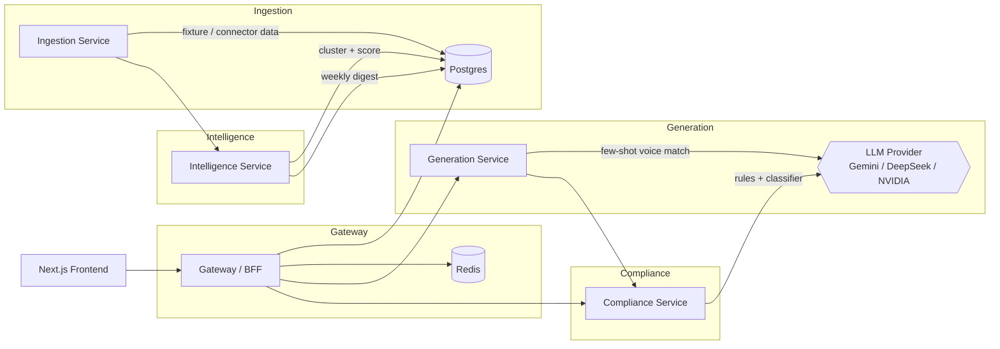
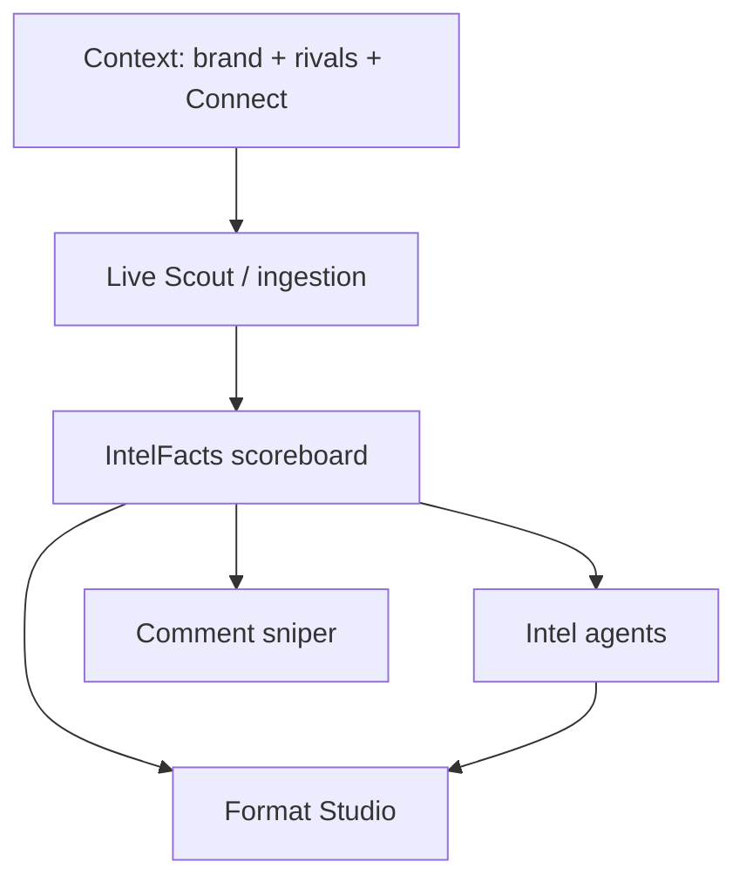
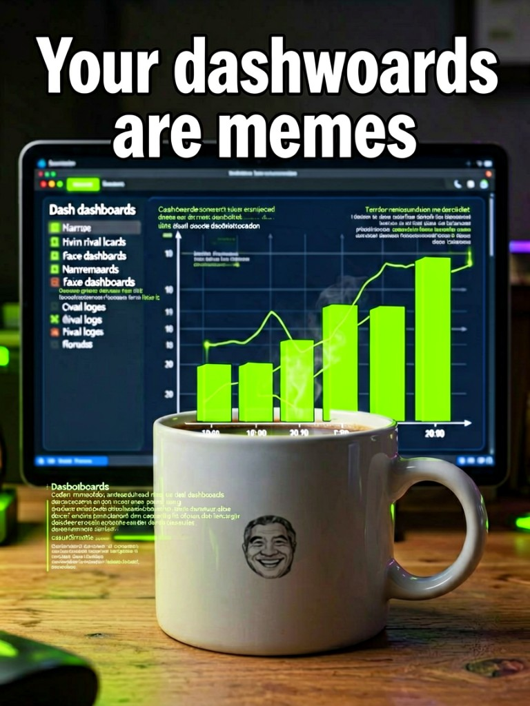
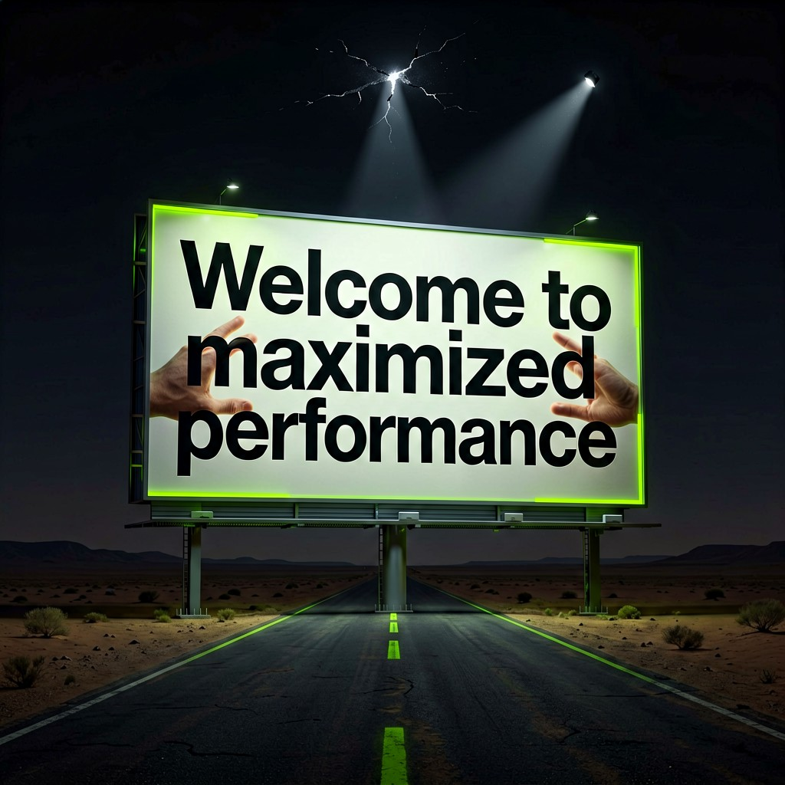
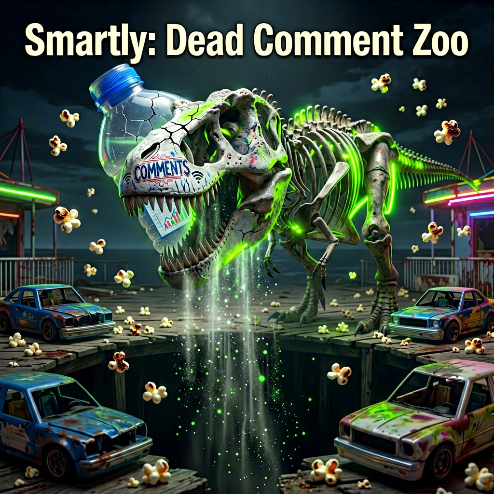

<p align="center">
  
</p>

<p align="center">
  <a href="https://github.com/negativenagesh/RivalRadar/stargazers"></a>
  <a href="https://github.com/negativenagesh/RivalRadar/blob/main/LICENSE"></a>
  <a href="https://github.com/negativenagesh/RivalRadar/actions/workflows/ci.yml"></a>
  <a href="https://github.com/negativenagesh/RivalRadar/commits/main"></a>
</p>

<p align="center">
  <a href="https://rival-radar-nine.vercel.app"></a>
  <a href="https://rivalradar-api-fl5j.onrender.com/health"></a>
  <a href="DEPLOY.md"></a>
</p>

An agent that watches competitor social content, spots what's trending, and drafts on-brand response posts (memes, product visuals, copy) in your brand's actual voice — queued for one-click human approval before publishing.

Most competitor-monitoring tools stop at "here's what they posted." RivalRadar goes one step further: it clusters competitor activity into a weekly trend-and-gap digest, then actually drafts your response — a caption in your brand's voice, and an image concept — and runs it through a brand-safety check before a human ever sees it. The human still approves every single thing that goes out; the agent's job is to make sure what lands on their desk is already 80% of the way there.

**Mission War Room** (frontend `/mission`) is the live operator path: Connect sessions → Live Scout → Intel brief (multi-agent) → Format Studio (memes / posts) → Comment sniper (approve-then-drop).

## Architecture



Full reasoning behind these service boundaries, the data flow, and the model-provider abstraction lives in [ARCHITECTURE.md](ARCHITECTURE.md).

## Quickstart

```bash
cp .env.example .env   # optional server keys; Mission prefers the Models chip in the UI
docker compose up --build
```

- Frontend: http://localhost:3000 → **Mission** for the war room
- Gateway API: http://localhost:8000
- Per-service docs: `services/<name>/README.md`

Operator LLM / image keys stay in **browser localStorage** (Models chip) and are forwarded as `X-Gemini-Key` / `X-DeepSeek-Key` / `X-Nvidia-Key` / `X-Agnes-Key` — never committed.

## Live deploy

| Surface | URL |
|---------|-----|
| **Frontend (Vercel)** | https://rival-radar-nine.vercel.app |
| **API (Render)** | https://rivalradar-api-fl5j.onrender.com |

Setup (env keys, CORS, Supabase, cold-start): [DEPLOY.md](DEPLOY.md).

## Mission War Room



| Step | What happens |
|------|----------------|
| **Context** | Brand dossier (voice, ICP, pillars, forbidden claims) + rival profiles (`whyTheyMatter`, socials) |
| **Connect** | Chrome extension (fast) or noVNC browser login — vaulted cookies for scout + sniper |
| **Live Scout** | Concurrent browser/OSS collect into the lookback window; posts stream into findings |
| **War room** | Scoreboard + agent intel + Format Studio + Comment sniper |

### Agents (generation service)

Prompts live in [`services/generation/app/agents/prompts.py`](services/generation/app/agents/prompts.py).

| Agent | Role | Output |
|-------|------|--------|
| **Intel Chief** | Evaluates scout FACTS only — never invents metrics | Long markdown brief + structured cards (`good_at`, `fumbling`, plays, sniper bait) |
| **Play Caller** | Extra weekly plays / format roast / sniper docket | Extra markdown report tabs |
| **Platform Scout** | Per-platform + head-to-head evals | Platform / competitive tabs |
| **Format Director** | On-brand studio posts for non-meme chips | caption, overlay, `why_slaps`, `image_brief` |
| **Meme Lord** | HARD Gen-Z roast memes; ROAST_PACK = joke fuel, not a scoreboard to paint | Same JSON shape; spice ≥ 4 pushes absurdist metaphors |
| **Comment Sniper** | One approve-ready reply on a rival permalink | Plain-text comment |
| **Voice Guard** | Strips forbidden claims / bot tone | Rewritten caption |

### Format Studio

- Chips: meme, hot take, founder 2am, receipt carousel, myth-bust, …
- Meme batch: **1–3** sequential generations with per-slot loading
- Context sent for memes: brand dossier + **roast pack** (brand vs rival metrics, visual%, cadence, themes, post receipts) — see UI blurb in Format studio
- Image paint: Gemini Nano Banana / Agnes / NVIDIA FLUX via operator Models chip; overlays must be letter-perfect; no rival logos in-frame

### Comment sniper

Uses the **operator’s Connect session**. Human must click Approve → Playwright drop with human-like delays. Not silent spray.

## Example meme outputs

Screenshots from real Format Studio runs (Pixis vs Smartly), with captions / overlays from the UI logs:

| | Overlay / caption from logs |
|--|-----------------------------|
|  | Caption: *Your dashboards are memes. We'll crunch the jokes.* · Overlay: `Your dashboards are memes` (early; image misspelled *dashwoards*) |
|  | Intended overlay *Your dashboards are memes* · Painted: `Welcome to maximized performance` (model drift) |
|  | Overlay: `Smartly: Likes` / `18 Likes, 0 Comments` — soft scoreboard era |
|  | Overlay: `Smartly: 0 Comments. Pixis: Real Action.` |
|  | Overlay: `Smartly: Dead Comment Zoo` — after HARD Gen-Z pass |

Full table + notes: [docs/examples/memes/README.md](docs/examples/memes/README.md).

## Why these technical choices

- **uv, not pip/poetry** — single fast resolver/lockfile per service, consistent everywhere including Dockerfiles; see [CONTRIBUTING.md](CONTRIBUTING.md).
- **FastAPI, async-first everywhere** — the pipeline is I/O-bound (HTTP between services, LLM calls, DB writes); async avoids thread-pool overhead for that shape of workload.
- **Real microservices, not a monolith-in-folders** — ingestion, intelligence, generation, and compliance are genuinely independent concerns with different scaling/failure profiles (e.g. generation calls an external LLM and should be rate-limited/retried independently of ingestion).
- **Gemini via its OpenAI-compatible endpoint, behind a provider abstraction** — lets us use the well-supported `openai` SDK instead of a second vendor SDK, while `libs/llm_provider` means swapping providers later never touches call sites. DeepSeek / NVIDIA / Agnes are selectable from the Models chip for Mission.
- **Postgres + local-disk object storage (S3-shaped interface)** — relational data (posts, digests, drafts, review state) is genuinely relational; the object-store interface is designed so a real S3 bucket is a config change, not a rewrite.

## Status

The full pipeline is runnable via `docker compose up --build`: ingestion → digest → draft generation → compliance → review UI, **plus** Mission war room (scout → multi-agent intel → Format Studio → approve-then-drop sniper). Frontend at :3000, gateway at :8000.

See [CHANGELOG.md](CHANGELOG.md) for what landed in each phase, [ARCHITECTURE.md](ARCHITECTURE.md) for service boundaries, and [PORTFOLIO_NOTES.md](PORTFOLIO_NOTES.md) for an honest write-up of what was hard, what I'd improve, and what breaks at scale.
