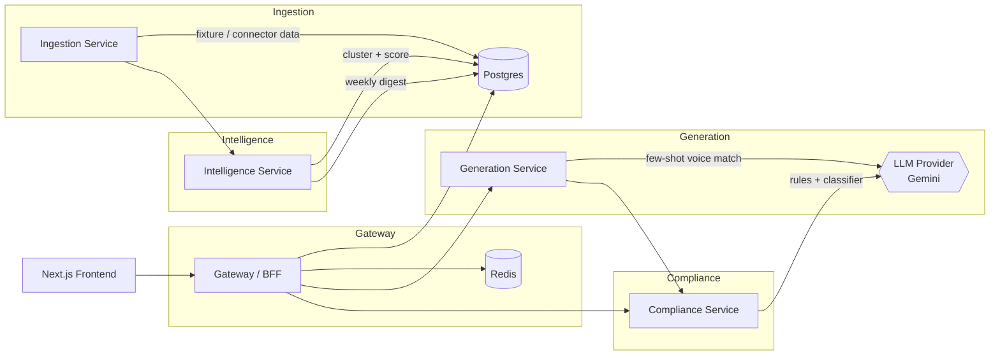

# RivalRadar

An agent that watches competitor social content, spots what's trending, and drafts on-brand response posts (memes, product visuals, copy) in your brand's actual voice — queued for one-click human approval before publishing.

Most competitor-monitoring tools stop at "here's what they posted." RivalRadar goes one step further: it clusters competitor activity into a weekly trend-and-gap digest, then actually drafts your response — a caption in your brand's voice, and an image concept — and runs it through a brand-safety check before a human ever sees it. The human still approves every single thing that goes out; the agent's job is to make sure what lands on their desk is already 80% of the way there.

## Architecture



Full reasoning behind these service boundaries, the data flow, and the model-provider abstraction lives in [ARCHITECTURE.md](ARCHITECTURE.md).

## Quickstart

```bash
cp .env.example .env   # fill in a real GEMINI_API_KEY
docker compose up --build
```

- Frontend: http://localhost:3000
- Gateway API: http://localhost:8000
- Per-service docs: `services/<name>/README.md`

## Why these technical choices

- **uv, not pip/poetry** — single fast resolver/lockfile per service, consistent everywhere including Dockerfiles; see [CONTRIBUTING.md](CONTRIBUTING.md).
- **FastAPI, async-first everywhere** — the pipeline is I/O-bound (HTTP between services, LLM calls, DB writes); async avoids thread-pool overhead for that shape of workload.
- **Real microservices, not a monolith-in-folders** — ingestion, intelligence, generation, and compliance are genuinely independent concerns with different scaling/failure profiles (e.g. generation calls an external LLM and should be rate-limited/retried independently of ingestion).
- **Gemini via its OpenAI-compatible endpoint, behind a provider abstraction** — lets us use the well-supported `openai` SDK instead of a second vendor SDK, while `libs/llm_provider` means swapping providers later never touches call sites.
- **Postgres + local-disk object storage (S3-shaped interface)** — relational data (posts, digests, drafts, review state) is genuinely relational; the object-store interface is designed so a real S3 bucket is a config change, not a rewrite.

## Status

Actively being built in public phases — see [CHANGELOG.md](CHANGELOG.md) for what's actually implemented today versus scaffolded.
